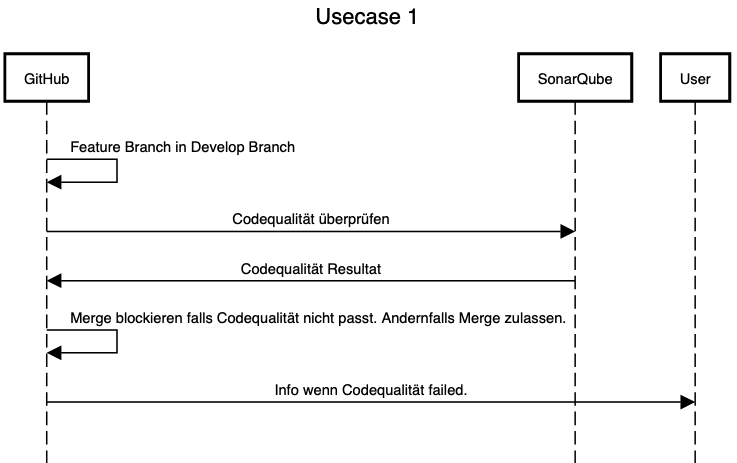
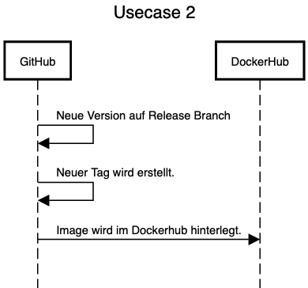
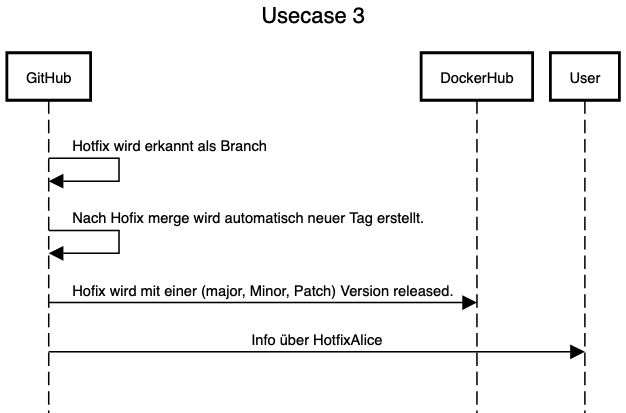
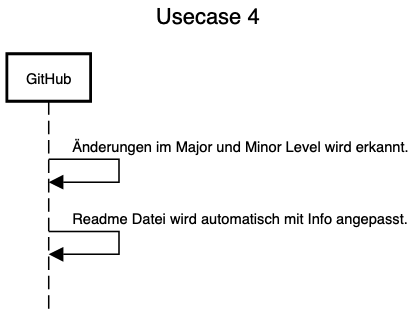
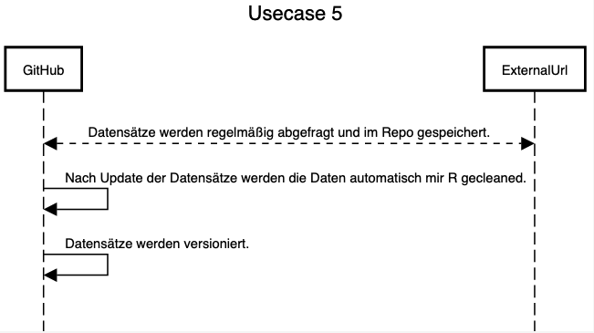

# CLC3-GitFlow

 - [ ] (1) Ein Entwickler möchte einen Feature Branch in den Master Branch mergen. Dabei wird Sonarqube dazu verwendet um die Codequalität zu checken und gegebenfalls den merge blockieren falls diese Pipeline failed. Benachrichtigung wird erzeugt.
  - [ ] (2) Es gibt eine neue Version auf dem Release Branch. Versionierung in Github mit Tags und ebenso Artifakte (Image) wird auf Docker automatisch ausgerollt.
  - [ ] (3) Hotfix wird erkannt und im Anschluss werden Update mit Versionen auf allen angegebenen Apps released in entsprechender Version (major minor patch)
  - [ ] (4) Nach einer Änderung auf Major und Minor Ebene soll die Readme Datei upgedated werden mit zusätzlichen Information darüber. 
  - [x] (5) Datenquelle(n) automatisch herunterladen, vorverarbeiten und cleanen und im Repo hinterlegen (inkl. Versionierung) => Es sollen Datensätze in unser Repositories automatisch (zB von einer Url) heruntergeladen werden und ebenso versionieren werden. Die Daten können zB. automaitsch halbjährlich aktualisieren werden. Die Daten sollen im Anschluss mit R gecleant werden um im Anschluss sofort / leicht damit zu arbeiten.
- [ ] Dokumentation für alle steps

# Info

[WHAT ARE WE EVEN DOING?](https://docs.google.com/spreadsheets/d/1TND9vrQhHt1GK2RZ2cM7CNtNGox4a7Rkn2qamFMTSvg/edit#gid=0)

[GITHUB ACTIONS WHAAAT?](https://docs.github.com/en/actions/learn-github-actions)

[Possible solution for readme update](https://github.community/t/possible-to-commit-files-after-workflow-runs/17824)

# Branches

CLC3 GitFlow Projekt

## Sequence diagrams for all use cases

# How did we do what?

## Usecase 1
[Stop merge if check not okay](https://stackoverflow.com/questions/58654530/how-to-auto-reject-a-pull-request-if-tests-are-failing-github-actions)
Successfull only means, that the check was completed, not that the check was successfull. Confusing, I know.
TMP FIX: Notification if activated in Settings > Notifications > Address & Approaved header + https://myaccount.google.com/lesssecureapps
