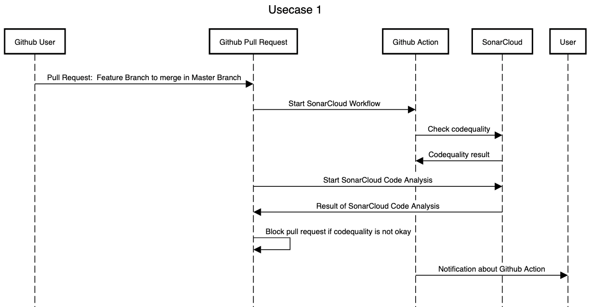

# Usecase 1

## Details

A developer wants to merge a feature branch into the master branch. Sonarqube is used to check the code quality and block the merge if this pipeline fails. Notification is generated and will be send to the user.

## Sequencediagram
Tool: [sequencediagram](https://sequencediagram.org/)



## Tutorial (step-by-step instructions & reproducibility)

### Connect the reporitory to SonarCloud
1. [Create Organization](https://sonarcloud.io/create-organization)  
2. Import an Organization from GitHub
3. Select the Organization
4. Give read/write Permissions
5. Select the Repository where you want to install SonarCloud
6. Save
7. Go back to [SonarCloud](https://sonarcloud.io/projects/create)
8. Select Organization and Repository
9. Press Set Up
10. Go to ```Administration``` -> ```Analysis Actions```
11. Press on ```Follow the tutorial``` in GitHub Action
12. Follow the tutorial

### Create personal github token for workflow
You should create a personal access token to use in place of a password with the command line or with the API.
1. Verify your email address, if it hasn't been verified yet.
2. In the upper-right corner of any page, click your profile photo, then click Settings.
3. In the left sidebar, click Developer settings.
4. In the left sidebar, click Personal access tokens.
5. Click Generate new token.
6. Give your token a descriptive name.
7. To give your token an expiration, select the Expiration drop-down menu, then click a default or use the calendar picker.
8. Select the scopes, or permissions, you'd like to grant this token. To use your token to access repositories from the command line, select repo.
9. Click Generate token.

### Create secret for workflow
Go to **Settings** --> **Secrets** --> **New repository secret**

Add Name: **"OUR_GITHUB_TOKEN"**

.. and **YOUR GITHUB TOKEN** in the Value field

### Create/Use an Email account
- IMAP und SMB must be activated
- Add the email username to GitHub secrets as EMAIL_USERNAME
- Add the email password to GitHub secrets as EMAIL_PASSWORD

### Create Workflow file
create '/.github/workflows/sonar.yml' with:

```
name: Check with Sonar
on:
  pull_request:
    branches: [ master ]
    types: [opened, synchronize, reopened]
jobs:
  sonarcloud:
    name: SonarCloud
    runs-on: ubuntu-latest
    steps:
      - uses: actions/checkout@v2
        with:
          fetch-depth: 0  
          
      - name: SonarCloud Scan
        uses: SonarSource/sonarcloud-github-action@master
        env:
          GITHUB_TOKEN: ${{ secrets.OUR_GITHUB_TOKEN }}  
          SONAR_TOKEN: ${{ secrets.SONAR_TOKEN }}
          
      - name: Send mail
        if: always()
        uses: dawidd6/action-send-mail@v2
        with:
          server_address: smtp.gmail.com
          server_port: 465
          secure: true

          username: ${{ secrets.EMAIL_USERNAME }}
          password: ${{ secrets.EMAIL_PASSWORD }}

          subject: ${{ github.job }} job of ${{ github.repository }} has ${{ job.status }}
          body: ${{ github.job }} job in worflow ${{ github.workflow }} of ${{ github.repository }} has ${{ job.status }}
          to: ${{ secrets.EMAIL_USERNAME }}
          from: CLC3 Gitflow
```

### How to prevent merging with errors in sonar
Go to 'Settings' --> 'Branches' --> 'Add rule'

Branch name pattern: "master"

Check 'Require status checks to pass before merging' on and search in the searchbar for 'SonarCloud Code Analysis' and click on it.

## How to start a workflow
Starts with a pull-request on the master branch, when the pull-request is either opened, synchronized or repopened
