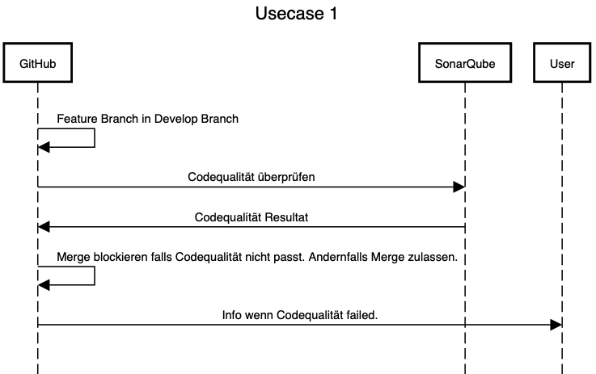

# Usecase 1

## Details

A developer wants to merge a feature branch into the master branch. Sonarqube is used to check the code quality and block the merge if this pipeline fails. Notification is generated and will be send to the user.

## Sequencediagram
Tool: [sequencediagram](https://sequencediagram.org/)

## Tutorial (step-by-step instructions & reproducibility)

## Lessons-learned
