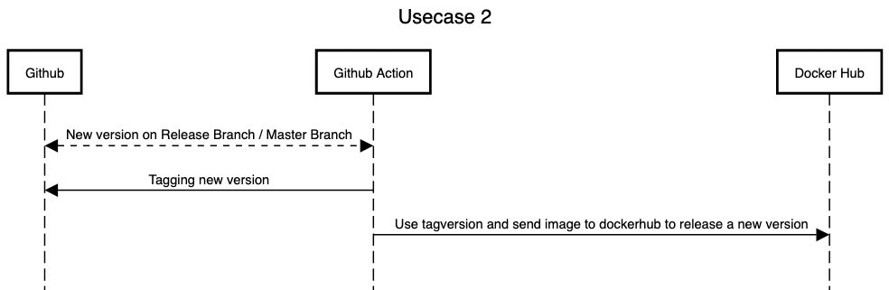

# Usecase 2

## Details

There is a new version on the release branch. Versioning in Github with tags and also artifacts (image) is rolled out on Docker automatically.

## Sequencediagram
Tool: [sequencediagram](https://sequencediagram.org/)



## Tutorial (step-by-step instructions & reproducibility)

### Create Workflow file
Create '/.github/workflows/docker.yml' with:

```
name: Docker Flow

on:
  push:
    branches: [ master ]
    paths-ignore:
      - '**/CHANGELOG.md'

  workflow_dispatch:

jobs:
  continuous_integration:
    runs-on: ubuntu-latest

    steps:
      - uses: actions/checkout@v2

      - name: Run a one-line script
        run: echo Start to test and build the artifact

      - name: Set up Docker Buildx
        uses: docker/setup-buildx-action@v1

      - name: Login to DockerHub
        uses: docker/login-action@v1 
        with:
          username: ${{ secrets.DOCKERHUB_USERNAME }}
          password: ${{ secrets.DOCKERHUB_TOKEN }}

      - name: Declare variables
        id: vars
        shell: bash
        run: |
          echo "::set-output name=branch::$(echo ${GITHUB_REF#refs/heads/})"
          echo "::set-output name=sha_short::$(git rev-parse --short HEAD)"
          
      - name: Bump version and push tag
        id: tag_version
        uses: mathieudutour/github-tag-action@v6.0
        with:
          github_token: ${{ secrets.OUR_GITHUB_TOKEN }}
          dry_run: 'True'
          
      - name: Log Version
        run: echo ${{ steps.tag_version.outputs.previous_tag }}
      
      - name: Build and push
        id: docker_build
        uses: docker/build-push-action@v2
        with:
          context: .
          push: true
          tags: ${{ secrets.DOCKERHUB_USERNAME }}/app:${{ steps.tag_version.outputs.previous_tag }}

```

### Create personal github token for workflow
You should create a personal access token to use in place of a password with the command line or with the API.
1. Verify your email address, if it hasn't been verified yet.
2. In the upper-right corner of any page, click your profile photo, then click Settings.
3. In the left sidebar, click Developer settings.
4. In the left sidebar, click Personal access tokens.
5. Click Generate new token.
6. Give your token a descriptive name.
7. To give your token an expiration, select the Expiration drop-down menu, then click a default or use the calendar picker.
8. Select the scopes, or permissions, you'd like to grant this token. To use your token to access repositories from the command line, select repo.
9. Click Generate token.

### Create secret for workflow
Go to **Settings** --> **Secrets** --> **New repository secret**

Add Name: **"OUR_GITHUB_TOKEN"**

.. and **YOUR GITHUB TOKEN** in the Value field

Add Name: **"DOCKERHUB_USERNAME"**

.. and **YOUR DOKERHUB USERNAME** in the Value field

Add Name: **"DOCKERHUB_TOKEN"**

.. and **YOUR DOKERHUB PASSWORD** in the Value field

## How to start the workflow
You don't need to trigger the workflow. It will check every day if there is an update on the datasource and will do the workflow automatically. You can trigger it if you want by clicking on 'Actions' --> 'Download Dataset' --> 'Run workflow'. Only if the file was changed it will update the files on Github.
