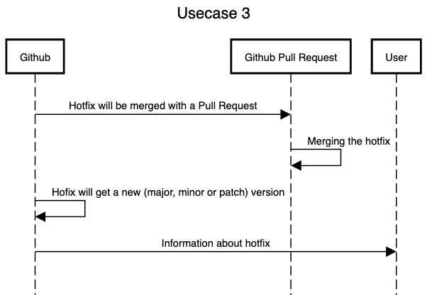

# Usecase 3

## Details

Hotfix is detected and subsequently update with versions on all specified apps are released in corresponding version (major minor patch).

## Sequencediagram
Tool: [sequencediagram](https://sequencediagram.org/)



## Tutorial (step-by-step instructions & reproducibility)
For this usecase it is necessary to create a github token. If you have not allready create a github action please follow these instructions create personal github token for workflow and create secret for workflow.

### Create personal github token for workflow 
You should create a personal access token to use in place of a password with the command line or with the API.
1. Verify your email address, if it hasn't been verified yet.
2. In the upper-right corner of any page, click your profile photo, then click Settings.
3. In the left sidebar, click Developer settings.
4. In the left sidebar, click Personal access tokens.
5. Click Generate new token.
6. Give your token a descriptive name.
7. To give your token an expiration, select the Expiration drop-down menu, then click a default or use the calendar picker.
8. Select the scopes, or permissions, you'd like to grant this token. To use your token to access repositories from the command line, select repo.
9. Click Generate token.

### Create secret for workflow
Go to **Settings** --> **Secrets** --> **New repository secret**

Add Name: **"OUR_GITHUB_TOKEN"**

.. and **YOUR GITHUB TOKEN** in the Value field

### Create tag.yml to your github actions
If you have created github tocken please create this ```tag.yml``` under your ```/.github/workflows```:
```
name: Increase Tags

on:
  push:
    branches: [ master ]  
    paths-ignore:
      - '**/CHANGELOG.md'
      
jobs:
  build:
    runs-on: ubuntu-latest
    steps:
      - uses: actions/checkout@v2
      
      - name: Bump version and push tag
        id: tag_version
        uses: mathieudutour/github-tag-action@v6.0
        with:
          github_token: ${{ secrets.OUR_GITHUB_TOKEN }}
          
      - name: Log Version
        run: echo ${{ steps.tag_version.outputs.new_tag }}
        
      - name: Create a GitHub release
        uses: ncipollo/release-action@v1
        with:
          tag: ${{ steps.tag_version.outputs.new_tag }}
          name: Release ${{ steps.tag_version.outputs.new_tag }}
          body: ${{ steps.tag_version.outputs.changelog }}
 ```
## How to start the workflow
### Write commit message to be apply hotfix 
To apply a hotfix, we are using [GitHub Tag Action](https://github.com/mathieudutour/github-tag-action#github-tag-action). This is used to automatically bump and tag master, on merge with the latest SemVer formatted version.  
1. Write a commit in the commit message of the hotfix commit: ```fix(YourCommitMessage): CommitSubject```
2. Make Pull Request to this commit to apply the hotfix 

The action will parse the new commits since the last tag using the [semantic-release](https://github.com/semantic-release/semantic-release) conventions.

semantic-release uses the commit messages to determine the type of changes in the codebase. Following formalized conventions for commit messages, semantic-release automatically determines the next [semantic version](https://semver.org) number.

By default semantic-release uses [Angular Commit Message Conventions](https://github.com/angular/angular.js/blob/master/DEVELOPERS.md#-git-commit-guidelines).

Here is an example of the release type that will be done based on a commit messages:

<table>
<tr>
<td> Commit message </td> <td> Release type </td>
</tr>
<tr>
<td>

```
fix(pencil): stop graphite breaking when too much pressure applied
```

</td>
<td>Patch Release</td>
</tr>
<tr>
<td>

```
feat(pencil): add 'graphiteWidth' option
```

</td>
<td>Minor Release</td>
</tr>
<tr>
<td>

```
perf(pencil): remove graphiteWidth option

BREAKING CHANGE: The graphiteWidth option has been removed.
The default graphite width of 10mm is always used for performance reasons.
```

</td>
<td>Major Release</td>
</tr>
</table>

If no commit message contains any information, then **default_bump** will be used.
