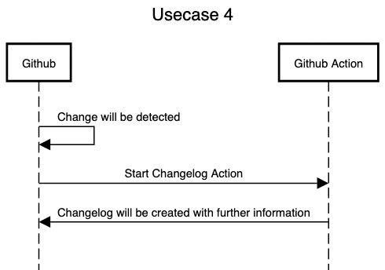

# Usecase 4

## Details

After a change on major and minor level the changelog / readme file should be updated with additional information about it.

## Sequencediagram
Tool: [sequencediagram](https://sequencediagram.org/)

## Tutorial (step-by-step instructions & reproducibility)

## How to start a workflow
