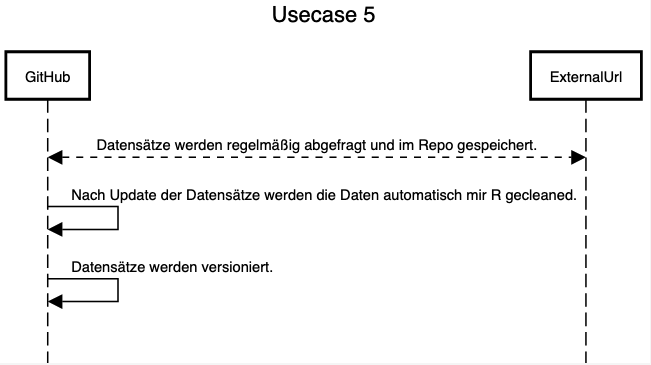

# Usecase 5

## Details
Tool: [sequencediagram](https://sequencediagram.org/)

Automatically download data source(s), preprocess and clean them and store them in the repo (incl. versioning) => Data sets in our repositories should be downloaded automatically (e.g. from a url) and versioned as well. The data can be updated e.g. automatically every six months. The data should then be cleansed with R in order to be able to work with it immediately / easily.

## Sequencediagram

## Tutorial (step-by-step instructions & reproducibility)

## Summary of lessons-learned
