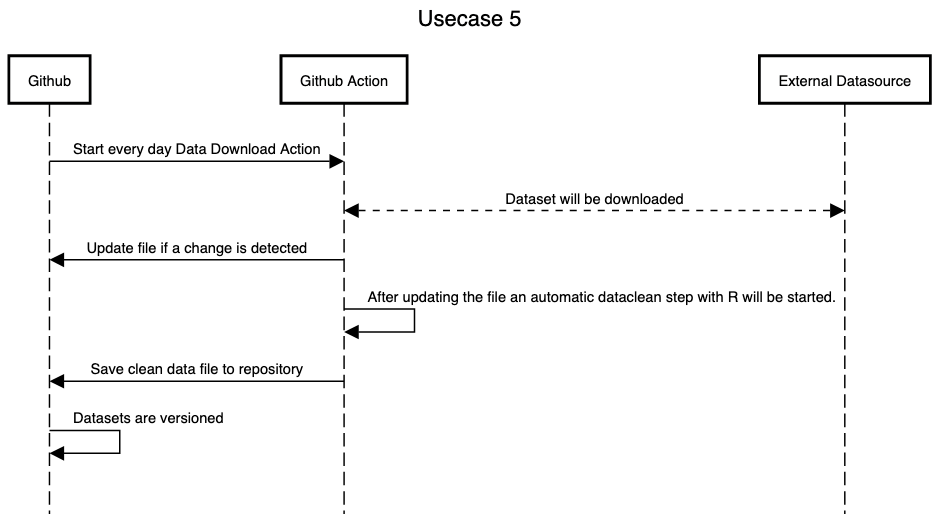

# Usecase 5

## Details

Automatically download data source(s), preprocess and clean them and store them in the repo (incl. versioning) => Data sets in our repositories should be downloaded automatically (e.g. from a url) and versioned as well. The data can be updated e.g. automatically every six months. The data should then be cleansed with R in order to be able to work with it immediately / easily.

## Sequencediagram
Tool: [sequencediagram](https://sequencediagram.org/)



## Tutorial (step-by-step instructions & reproducibility)

### Create Workflow file
Create '/.github/workflows/data.yml' with:

```
name: Download Dataset

on:
  schedule:
    - cron: 0 0 * * * 
  workflow_dispatch: {}
  
jobs:
  scheduled:
    runs-on: ubuntu-latest
    steps:
      - name: Setup deno
        uses: denoland/setup-deno@main
        with:
          deno-version: v1.x

      - name: Check out repo
        uses: actions/checkout@v2

      - name: Fetch data
        uses: githubocto/flat@v2
        with:
          http_url: ${{ secrets.DATA_URL }} 
          downloaded_filename: data/raw.xlsx 
          postprocess: data/help/postprocess.ts 
```

### Create clean.R file
Create '/data/help/clean.R' with:

```
# Load libraries
library(dplyr)
library(stringr)

# Read in data, with the same name that we specified in `flat.yml`
raw_data <- readxl::read_excel("data/raw.xlsx")

# All the processing!
clean_data <- raw_data %>% 
  rename("Date" = `Date of Incident (month/day/year)`,
         "Link" = `Link to news article or photo of official document`,
         "Armed Status" = `Armed/Unarmed Status`, 
         "Age" = `Victim's age` , 
         "Race" = `Victim's race`, 
         "Sex" = `Victim's gender`, 
         "Image" = `URL of image of victim`, 
         "Name" = `Victim's name`) %>% 
  mutate(Zipcode = as.character(Zipcode),
         Year = lubridate::year(Date),
         Sex = ifelse(is.na(Sex), 'Unknown', Sex)) %>% 
  arrange(Date)

### Additional processing goes here...

# Output data
readr::write_csv(clean_data, "data/output.csv")
```

### Create postprocess.ts file
Create '/data/help/postprocess.ts' with:

```
// 1. Install necessary packages
const r_install = Deno.run({
    cmd: ['sudo', 'Rscript', '-e', "install.packages(c('dplyr', 'readxl', 'readr', 'lubridate', 'stringr'))"]
});

await r_install.status();

// 2. Forward the execution to the R script
const r_run = Deno.run({
    cmd: ['Rscript', 'data/help/clean.R']
});

await r_run.status();
```

### Create secret for workflow
Go to **Settings** --> **Secrets** --> **New repository secret**

Add Name: **"DATA_URL"** 

.. and **YOUR URL** in the Value field

## How to start the workflow
You don't need to trigger the workflow. It will check every day if there is an update on the datasource and will the the workflow automatically. You can trigger it if you want by clicking on 'Actions' --> 'Download Dataset' --> 'Run workflow'. Only if the file was changed it will update the files on Github.
