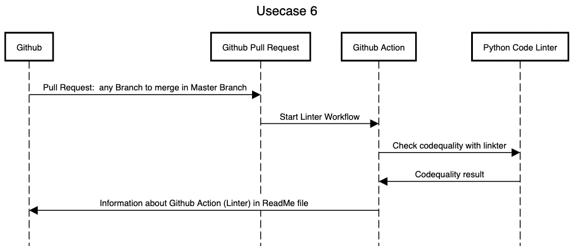

# Usecase 6

## Details

A developer wants to merge a update into master branch. A code linter should automatically start after creating pull request und start to lint the code. Information about linter status should be visual in the Readme file.

## Sequencediagram
Tool: [sequencediagram](https://sequencediagram.org/)

## Tutorial (step-by-step instructions & reproducibility)

## Lessons-learned
