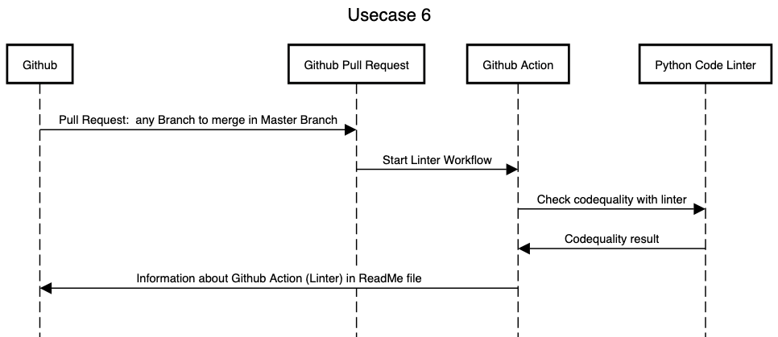

# Usecase 6

## Details

A developer wants to merge a update into master branch. A code linter should automatically start after creating pull request und start to lint the code. Information about linter status should be visual in the Readme file.

## Sequencediagram
Tool: [sequencediagram](https://sequencediagram.org/)



## Tutorial (step-by-step instructions & reproducibility)

### Create Workflow file
Create '/.github/workflows/linter.yml' with:

```
name: Lint Code Base

on:
  push:
    branches-ignore: [master]
    
  pull_request:
    branches: [master]

jobs:
  build:
    name: Lint Code Base
    runs-on: ubuntu-latest

    steps:
      - name: Checkout Code
        uses: actions/checkout@v2
        with:
          fetch-depth: 0

      - name: Lint Code Base
        uses: github/super-linter@v4
        env:
          VALIDATE_ALL_CODEBASE: false
          DEFAULT_BRANCH: master
          GITHUB_TOKEN: ${{ secrets.OUR_GITHUB_TOKEN }}
```

Update 'ReadMe.md' with:
```
[](https://github.com/marketplace/actions/super-linter)
```

## Lessons-learned
